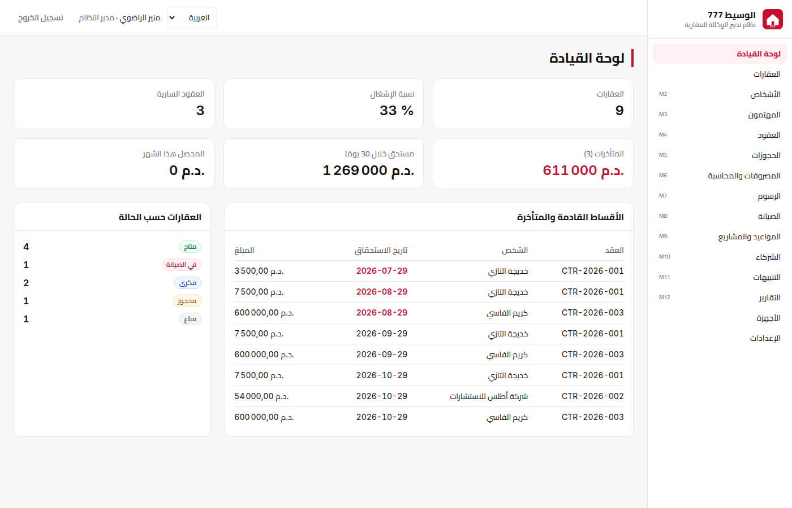
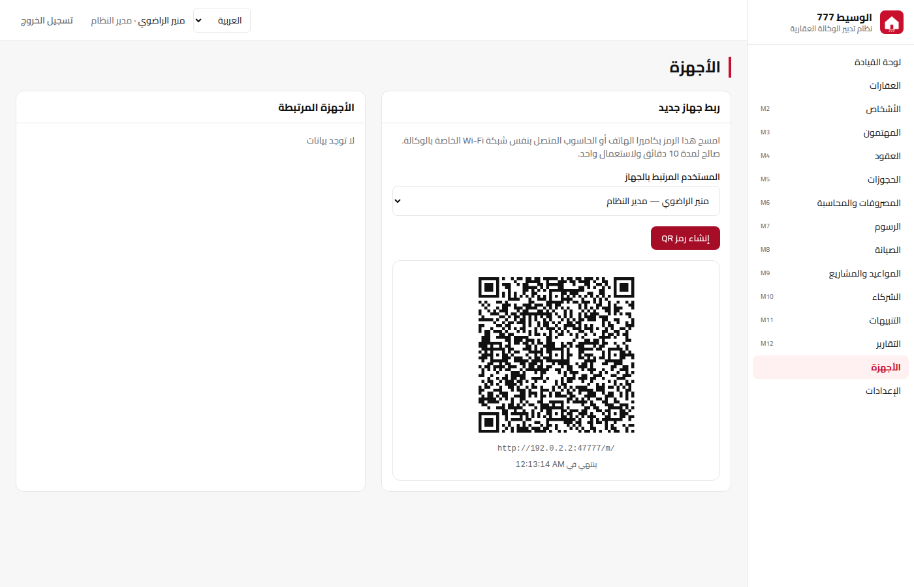
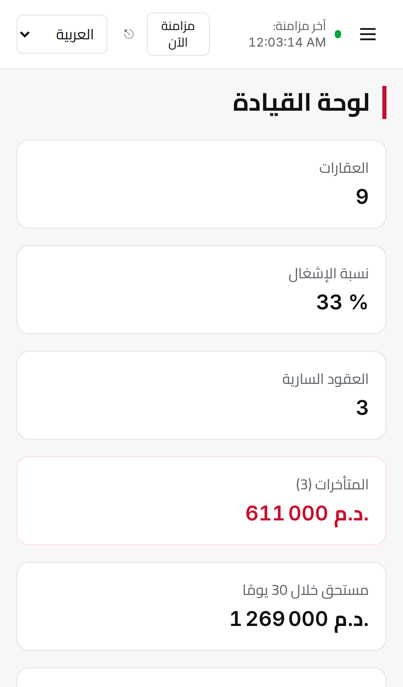
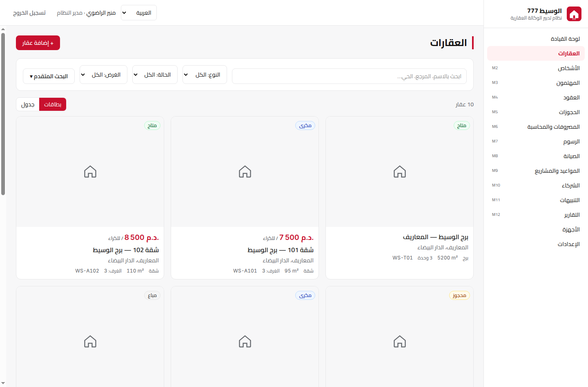
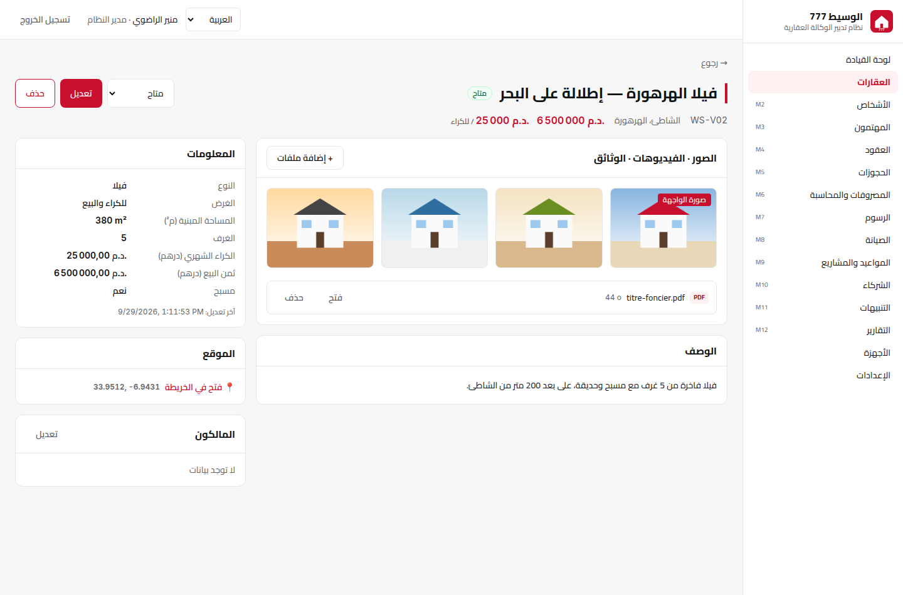
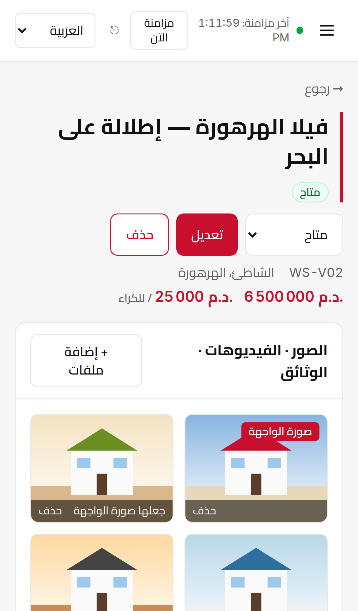

# Al Wasset 777 — Système de gestion immobilière

Application **local-first** pour l'agence : le Mac est la base de données centrale (SQLite chiffrée), les téléphones et autres ordinateurs s'y appairent par **QR code** et se synchronisent sur le Wi-Fi de l'agence, même sans internet.

| Mac (arabe) | Appareils + QR code | iPhone (PWA) |
|---|---|---|
|  |  |  |

## État d'avancement

| Étape | Contenu | État |
|---|---|---|
| **P0 — Socle** | Monorepo, Electron, base chiffrée + migrations + démo, connexion et rôles, i18n ar/fr/en + RTL, thème, écran « Appareils » + QR, synchro LAN, `build:mac` | ✅ |
| **M1 — Biens** | Création / modification / suppression, lots d'immeubles, propriétaires et quotes-parts, photos / vidéos / documents, localisation par lien Google Maps, attributs personnalisés, recherche avancée | ✅ |
| M2 → M12 | Schéma de base déjà créé pour tous les modules ; écrans à venir, module par module | ⏳ |

## Module M1 — Biens (العقارات)

| Grille des biens | Fiche d'un bien | iPhone |
|---|---|---|
|  |  |  |

- **Types :** tour, immeuble, appartement, villa, bureau, local commercial, magasin, showroom, terrain, autre.
- **Lots :** une tour ou un immeuble regroupe ses lots. Le bouton « إضافة وحدة » reprend l'adresse et la position de l'immeuble.
- **Références automatiques** par type (`WS-A…`, `WS-V…`, `WS-T…`), ou saisie libre. Les doublons sont refusés.
- **Recherche :**
  - texte insensible aux variantes arabes (ة/ه، أ/إ/ا، ى/ي), aux diacritiques et aux accents ;
  - filtres : type, statut, destination, ville, prix min/max (loyer ou vente), surface, pièces ;
  - tri, affichage en cartes ou en tableau.
- **Médias :**
  - photos, vidéos, PDF et documents Office, ajoutés par glisser-déposer ou avec le bouton « إضافة ملفات » ;
  - la première photo est la photo principale ;
  - visionneuse plein écran ; les documents s'ouvrent dans l'application du Mac.
- **Stockage des médias :** sur le disque du Mac (`~/Library/Application Support/Al Wasset 777/media`). Chaque fichier est identifié par son empreinte SHA-256, donc un même fichier n'est jamais stocké deux fois. La taille n'est limitée que par le disque.
- **Sur le téléphone :**
  - les photos sont téléchargées depuis le Mac à l'affichage ;
  - une photo prise sur le terrain est envoyée directement au Mac, jusqu'à 4 Go par fichier (connexion au Wi-Fi de l'agence requise).
- **Localisation :** coller un lien Google Maps ou Apple Plans, ou saisir « 33.58, -7.63 » ; le lien « فتح في الخريطة » ouvre la carte. Les liens courts `maps.app.goo.gl` ne contiennent pas les coordonnées : il faut les ouvrir puis copier le lien complet.
- **Attributs personnalisés** (Paramètres → administrateur) : texte, nombre, oui/non, date ou liste de choix, libellés en ar/fr/en.
- **Suppression :** refusée si le bien a des lots ou un contrat actif. C'est une suppression douce, propagée à tous les appareils.
- **Droits :**
  - seuls les rôles qui peuvent modifier les biens (administrateur, gestionnaire, commercial) créent, modifient ou ajoutent des médias ;
  - le Mac revérifie chaque changement reçu d'un téléphone.

## Prérequis

- macOS 12+ (Apple Silicon ou Intel) pour construire le `.dmg`
- Node.js ≥ 22 et npm ≥ 10

## Installation et développement

```bash
cd app
npm install
npm run build -w mobile   # la PWA mobile est servie par le Mac
npm run dev               # lance Vite + Electron avec rechargement à chaud
```

Autres commandes :

```bash
npm test            # 65 tests : finance, synchro, appairage LAN, chiffrement, biens, médias
npm run typecheck   # TypeScript strict sur les 3 paquets
npm run dev:mobile  # PWA seule sur http://localhost:5174/m/ (proxy /api → Mac)
```

## Construire le .dmg

```bash
cd app
npm run build:mac
# → desktop/release/AlWasset777-0.2.0-arm64.dmg et -x64.dmg
```

- **Sans compte Apple Developer** (configuration actuelle) : le `.dmg` n'est pas signé. Au premier lancement : clic droit sur l'app → **Ouvrir** → **Ouvrir**.
- **Avec un compte Apple Developer** : dans `desktop/electron-builder.yml`, supprimer `identity: null`, passer `notarize: true`, puis définir `CSC_LINK`, `CSC_KEY_PASSWORD`, `APPLE_ID`, `APPLE_APP_SPECIFIC_PASSWORD` et `APPLE_TEAM_ID` avant `npm run build:mac`.

Le module SQLCipher est livré précompilé (N-API) pour macOS arm64/x64 : aucune compilation native n'est nécessaire.

## Premier lancement

1. L'écran **« إعداد الوكالة لأول مرة »** demande le nom de l'agence, l'administrateur et son mot de passe.
2. Cocher **« بيانات تجريبية »** pour charger la démo : 10 biens, 10 personnes, 3 contrats avec échéanciers et paiements, et 4 utilisateurs de démo (`manager`, `commercial`, `comptable`, `maintenance`).
3. Les utilisateurs de démo ont le même mot de passe provisoire que l'administrateur et doivent le changer à la première connexion.

## Appairer un téléphone ou un autre ordinateur (QR code)

1. Le Mac et le téléphone sont sur le **même Wi-Fi**.
2. Sur le Mac : **الأجهزة / Appareils** → choisir l'utilisateur → **إنشاء رمز QR**.
3. Scanner avec l'appareil photo du téléphone : l'application s'ouvre et se synchronise. Le QR code est valable 10 minutes et ne sert qu'une fois.
4. Pour « installer » l'app : Safari → Partager → **Sur l'écran d'accueil**.
5. Un appareil perdu se révoque en un clic ; il est alors déconnecté et sa base locale est effacée.

Au premier lancement, macOS demande l'autorisation « réseau local » : il faut l'accepter.

## Où sont les données ? Sauvegarde

| Élément | Emplacement (macOS) |
|---|---|
| Base chiffrée | `~/Library/Application Support/Al Wasset 777/data/alwasset.db` |
| Clé de la base | `…/data/alwasset.key`, elle-même chiffrée par le **Trousseau macOS** |
| Photos, vidéos, documents | `~/Library/Application Support/Al Wasset 777/media/` (non chiffrés, protégés par la session macOS) |

⚠️ La base n'est lisible qu'avec sa clé, et la clé n'est lisible que sur ce Mac. Copier ces fichiers sur un autre Mac ne suffit **pas** pour restaurer.

La sauvegarde chiffrée automatique et la restauration (export d'une archive protégée par un mot de passe que vous choisissez) arrivent avec le module M6. D'ici là, faire une sauvegarde **Time Machine** complète du Mac.

## Architecture

```
app/
├── shared/              # code commun desktop + mobile
│   ├── src/db/          # pilotes SQLite, migrations (schéma M1→M12), store journalisé
│   ├── src/sync/        # horloge HLC, moteur de fusion champ par champ, protocole
│   ├── src/finance/     # montants en centimes, échéanciers, imputation, pénalités, CGNC
│   ├── src/auth/        # rôles et permissions
│   ├── src/services/    # setup, démo, tableau de bord, biens…
│   ├── src/i18n/        # ar (par défaut), fr, en
│   └── src/ui/          # interface React + Tailwind (RTL, thème blanc/rouge)
├── desktop/             # Electron : base SQLCipher, IPC, serveur LAN, packaging .dmg
└── mobile/              # PWA : même schéma sur sql.js (WebAssembly) + IndexedDB
```

### Synchronisation

- Toute écriture passe par `shared/src/db/store.ts`, qui journalise chaque champ modifié avec un horodatage **HLC** dans `change_log`.
- Les appareils envoient leurs changements au Mac (`/api/sync/push`) et récupèrent ceux des autres (`/api/sync/pull`).
- **Règle de conflit :** pour chaque champ, la modification la plus récente l'emporte. Deux personnes qui modifient deux champs différents d'une même fiche ne se gênent pas.
- **Sécurité :**
  - les mots de passe ne quittent jamais le Mac ;
  - chaque changement reçu est vérifié contre les droits du rôle de l'appareil (un commercial ne peut pas modifier les utilisateurs) ;
  - chaque appareil a un secret unique, révocable.

### Choix techniques notables

| Choix | Raison |
|---|---|
| Electron (plutôt que Tauri) | SQLCipher natif et Chromium intégré (PDF arabes corrects) |
| sql.js sur mobile (plutôt que Dexie) | Même schéma SQL et mêmes services partout ; stocké dans IndexedDB |
| Montants en centimes (entiers) | Aucune erreur d'arrondi |
| Comptabilité en partie double (CGNC) | Écritures automatiques à chaque paiement. Les loyers des biens de mandants sont crédités au compte de tiers 4487 ; seule la commission est un produit de l'agence |

## Limites connues de P0

- **iPhone hors de l'agence :** le téléphone ne se synchronise que sur le Wi-Fi de l'agence. Le relais internet chiffré (Supabase) sera ajouté ensuite ; les données locales restent consultables hors ligne.
- **Mode hors ligne sur iPhone :** servie en `http://` depuis le Mac, la PWA ne peut pas activer son service worker. Une fois le relais en place, elle sera aussi publiée en HTTPS (installable et 100 % hors ligne).
- **Copie des données :** chaque appareil appairé reçoit toutes les données, sauf les mots de passe. Un filtrage par rôle (par exemple la comptabilité masquée aux commerciaux sur mobile) est prévu.
- **Modules M2 à M12 :** leurs écrans arrivent module par module.
- **Photos sur le téléphone hors de l'agence :** hors connexion au Mac, les photos non encore affichées apparaissent comme un espace réservé. Les fiches restent consultables.
- **Carte :** pas de carte interactive intégrée pour l'instant (elle nécessiterait internet). Le lien ouvre Google Maps.
